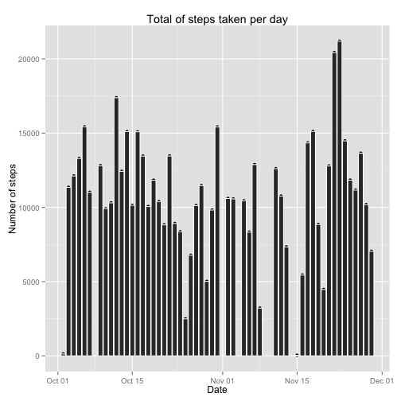
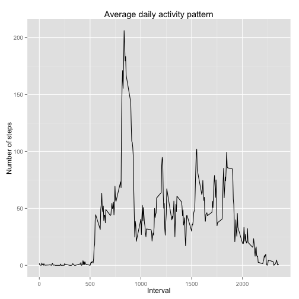
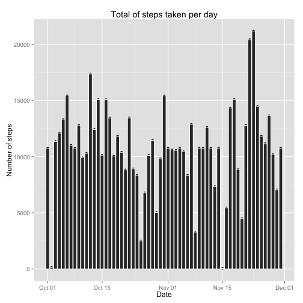
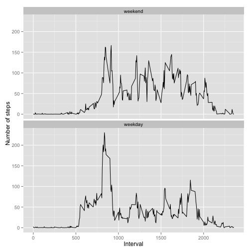

# Reproducible Research: Peer Assessment 1


```
## data.table 1.9.2  For help type: help("data.table")
```


## Loading and preprocessing the data

The dataset to be analysed is contained in the "activity.zip" archive file. The
zip file is available under the working directory defined for this Peer
Assessment. The file will be unzipped if not already done, then read using the
right column classes. The number of rows in the file is checked against the
given total of 17,568 observations in the dataset.

The variables included in this dataset are:

* steps: Number of steps taking in a 5-minute interval (missing values are coded as NA)
* date: The date on which the measurement was taken in YYYY-MM-DD format
* interval: Identifier for the 5-minute interval in which measurement was taken


```r
## Set the working directory
setwd(paste0(Sys.getenv("HOME"), "/datasciencecoursera/RepData_PeerAssessment1"))

## Unzip the file if not already done
if (!file.exists("./activity.csv"))
{
        unzip("./activity.zip")
}

## Read the file with the appropriate column formats
df <- read.csv("./activity.csv", sep = ",",
               colClasses = c("integer", "Date", "integer"))

## Assert the file is the right number of rows
assert <- ifelse(nrow(df) == 17568, "correct", "incorrect")
```

The number of read lines in the "activity.csv" file is correct.


## What is mean total number of steps taken per day?

For this part of the assignment, the missing values in the dataset are ignored.
The dataset is tidied by removing the NAs with the complete.cases() function,
then copyied to a data table to take advantage of the "data.table" package.
Data is aggregated by date, then the number of steps are summed. The histogram
of the total number of steps taken each day is generated using the "ggplot2"
graphics package. Below the graph, the mean and median total number of steps
taken per day are reported.


```r
## Get rid of NAs and suppress the rownames column
df1 <- df[complete.cases(df), ]
rownames(df1) <- NULL

## Convert the tidy data frame to a data table
dt1 <- as.data.table(df1)

## Aggregate the data table by date, then sum the number of steps
dt1 <- dt1[, list(SUM = sum(steps)), by = date]

## Quick plot the graph using ggplot2 graphics package
qplot(dt1$date, dt1$SUM, data = dt1) +
        geom_histogram(stat = "identity", colour = "white") +
        labs(title = "Total of steps taken per day") +
        labs(x = "Date", y = "Number of steps")
```

 

```r
## Calculate the mean and median for the total number of steps taken per day
meansteps <- round(mean(dt1$SUM), digits = 2)
mediansteps <- round(median(dt1$SUM), digits = 2)
```

The mean and median total number of steps taken per day are respectively 10766.19 and 10765.


## What is the average daily activity pattern?

For this part of the assignment, the missing values in the dataset are ignored.
The dataset is tidied by removing the NAs with the complete.cases() function,
then copyied to a data table to take advantage of the "data.table" package.
Data is aggregated by interval, then the number of steps are averaged. The time
series plot of the 5-minute interval (x-axis) and the average number of steps
taken, averaged across all days (y-axis) is generated using the "ggplot2"
graphics package. Below the graph, the 5-minute interval, on average across all
the days in the dataset, containing the maximum number of steps is reported.


```r
## Get rid of NAs and suppress the rownames column
df2 <- df[complete.cases(df), ]
rownames(df2) <- NULL

## Convert the tidy data frame to a data table
dt2 <- as.data.table(df2)

## Aggregate the data table by interval, then average the number of steps
dt2 <- dt2[, list(MEAN = mean(steps)), by = interval]

## Quick plot the graph using ggplot2 graphics package
qplot(dt2$interval, dt2$MEAN, data = dt2, geom = "line") +
        labs(title = "Average daily activity pattern") +
        labs(x = "Interval", y = "Number of steps")
```

 

```r
## Calculate the 5-minute interval containing the maximum number of steps
maxsteps <- dt2[dt2$MEAN == max(dt2$MEAN), ]$interval
```

The 5-minute interval, on average across all the days in the dataset, containing the maximum number of steps is 835.


## Imputing missing values

### Mean for 5-minute interval strategy

The presence of missing days may introduce bias into some calculations or
summaries of the data. The chosen approach to replace these missing values is by
considering the mean for that 5-minute interval. The missing observations are
calculated with the complete.cases() function. A complete dataset is created by
copying the original one, and by replacing the missing values according to the
chosen strategy (mean for 5-minute interval). The complete dataset is then
copyied to a data table to take advantage of the "data.table" package. Data is
aggregated by date, then the number of steps are summed. The histogram of the
total number of steps taken each day is generated using the "ggplot2" graphics
package. Below the graph, the number of missing values, the adjusted average and
median are reported.


```r
## Calculate the total number of missing values in the dataset
nbmissingvalues <- nrow(df[!complete.cases(df), ])

## Create a complete dataset by filling the missing values in the dataset using
## the mean for that 5-minute interval
dftemp <- df[!complete.cases(df), ]
dfcomplete <- df
for (i in 1:nrow(dt2))
{
        dftemp[dftemp$interval == dt2[i, ]$interval, ]$steps <- dt2[i, ]$MEAN
}
for (i in 1:nrow(dftemp))
{
        dfcomplete[as.integer(row.names(dftemp[i, ])), ]$steps <- dftemp[i, ]$steps
}

## Convert the complete data frame to a data table
dtcomplete1 <- as.data.table(dfcomplete)

## Aggregate the data table by date, then sum the number of steps
dtcomplete1 <- dtcomplete1[, list(SUM = sum(steps)), by = date]

## Quick plot the graph using ggplot2 graphics package
qplot(dtcomplete1$date, dtcomplete1$SUM, data = dtcomplete1) +
        geom_histogram(stat = "identity", colour = "white") +
        labs(title = "Total of steps taken per day") +
        labs(x = "Date", y = "Number of steps")
```

 

```r
## Calculate the mean and median for the total number of steps taken per day
adjmeansteps <- round(mean(dtcomplete1$SUM), digits = 2)
adjmediansteps <- round(median(dtcomplete1$SUM), digits = 2)
```

The total number of missing values in the dataset is 2304.

The adjusted mean and median total number of steps taken per day are respectively 10766.19 and 10766.19.


### Impact on imputing missing values

The impact of imputing missing data on the estimates of the total daily number
of steps with the choses strategy (mean for 5-minute interval) is rather
insignificant. To demonstrate this, the averages and means of the original and
complete datasets are compared by substracting the values. The average
difference is almost 0, whereas the median difference is a little more that 1.
The numbers of days with missing data over the 2-month period is reported below.


```r
## Calculate the difference of means between the complete and original datasets
diffmean <- round(mean(dtcomplete1$SUM) - mean(dt1$SUM), digits = 2)

## Calculate the difference of medians between the complete and original datasets
diffmedian <- round(median(dtcomplete1$SUM) - median(dt1$SUM), digits = 2)

## Calculate the numbers days with missing data
diffdates <- length(unique(dtcomplete1$date)) - length(unique(dt1$date))
```

Adjustment of the dataset with missing values results in difference of mean and median of respectively 0 and 1.19 with 8 days of missing data.


## Are there differences in activity patterns between weekdays and weekends?

The final analysis for this assignment is to determing whether there are
differences in activity patterns between weekdays and weekends. A factor
variable is added to the dataset, specifying if a date is a weekday or a
weekend, using the weekdays() function. The dataset is copyied to a data table
to take advantage of the "data.table" package. Data is aggregated by interval
and daytype, then the number of steps are averaged. The time series plot of the
5-minute interval (x-axis) and the average number of steps taken, averaged
across weekends and weekdays (y-axis) is generated using the "ggplot2"
graphics package. The two graphs are stacked vertically using the facet_wrap()
function.


```r
## Create a new factor variable in the dataset with two levels - "weekday" and
## "weekend" indicating whether a given date is a weekday or weekend day
dfcomplete$daytype <- as.factor(ifelse(weekdays(dfcomplete$date) == "Saturday" |
                                       weekdays(dfcomplete$date) == "Sunday",
                                "weekend", "weekday"))

## Order the factors according to the requested levels
levels(dfcomplete$daytype) <- c("weekend", "weekday")

## Convert the complete data frame to a data table
dtcomplete2 <- as.data.table(dfcomplete)

## Aggregate the data table by interval and daytype, then average the number of steps
dtcomplete2 <- dtcomplete2[, list(MEAN = mean(steps)), by = list(interval, daytype)]

## Plot the graph using ggplot2 graphics package
ggplot(dtcomplete2, aes(interval, MEAN)) +
        geom_line() +
        facet_wrap(~ daytype, nrow = 2) +
        labs(x = "Interval") +
        labs(y = "Number of steps")
```

 
